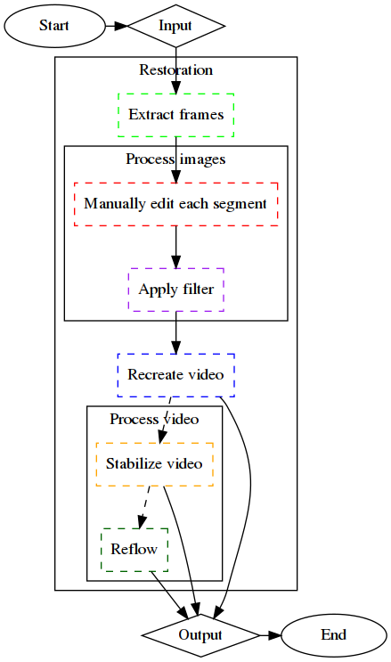

# Restoration

A collection of techniques and processing pipelines with the goal of restoration, touch up and enhancement of old image and video material.

## Methodologies

A. Manual approach

### Flowchart



### Methodology

1. Extract frames

```
$ mkdir frames output
$ ffmpeg -i input.mp4 -q:v 2 'frames/%06d.jpg'
```

2. Manual restoration
  - Recover each visually unique segment
  - For an universal filter, iterate over all segments multiple times

3. Apply filter

```
$ for F in frames/*.jpg; do
  darktable-cli "${F}" filter.xmp "output/${F##*/}"
done
```

4. Recreate video

```
$ printf 'file %s\n' output/*.jpg > frames.ls
$ FPS=30; ffmpeg -r ${FPS} -f concat -i frames.ls -c:v libx264 -r ${FPS} -pix_fmt yuv420p "output-${FPS}.mp4"
```

5. Stabilize video

```
$ ffmpeg -i "output-${FPS}fps.mp4" -filter:v "vidstabdetect=shakiness=10:accuracy=15:result=vidstab${FPS}fps.trf" -f null /dev/null
$ ffmpeg -i "output-${FPS}fps.mp4" -c:v libx264 -pix_fmt yuv420p -filter_complex "[0:v] vidstabtransform=input=vidstab${FPS}fps.trf:smoothing=40:optzoom=2:zoomspeed=0.75:interpol=bilinear" -preset medium -crf 18 "output-stabilized-${FPS}fps.mp4"
```

6. Reflow video

```
$ vspipe --arg in_filename="output-stabilized-${FPS}fps.mp4" --arg display_fps=60 --y4m motioninterpolation-vspipe-60fps.py - | ffmpeg -i - -s 1440x1080 -crf 18 -c:v libx264 -preset slow -profile:v high -level:v 4 -pix_fmt yuv420p -y "output-stabilized-${FPS}fps.reflow@60fps.mp4"
```


### Resuts

| Input | Output |
|:-----:|:------:|
|  |  |

### Notes

* This approach uses freely available tools under GNU/Linux, so that anybody can have access to them.
* Material quality is crucial, but often limited to only one source.
* Using noisy material might not be necessarily disadvantegous, since it typically helps recover details along with medium, compression and other noise.
* Using lossly formats for extracted frames makes sense when source material is of bad quality or there is a space limit constraint.
* Separate filters for each segment are recommended, but can be very time consuming to adjust and achieve an uniform look across the whole material.
* Applying filtering in parallel ought to be used whenever possible, however not all tools allow for multiple instances easily, such as `darktable`. One approach could be:

```
$ for F in frames/*.jpg; do
  [[ -f "output/${F##*/}" ]] && continue;
  ((I=I%5)); ((I++==0)) && wait;
  CONF="/tmp/darktable/${RANDOM}";
  { darktable-cli "$F" filter.xmp "output/$F" --core --library ':memory:' --configdir "$CONF" && rm -rf "$CONF"; } &;
done
```

* Filtering every other frame or every so often can be useful to check how well the filters work without waiting for all frames to be processed. Already generated frames can be then skipped, when complete material is being processed.
* Depending on technology used, there might be fluctations in framerate as well as 
* For comparison of various steps with the video material one can use `ffplay`:

```
A=a.mp4; B=b.mp4; SCALE=$(($(xdpyinfo | awk '/dimensions:/{sub("[0-9]*x", "", $2); print $2}') / 2)); ffplay -f lavfi "movie=${A}, scale=450:-1 [v0]; movie=${B}, scale=450:-1 [v1]; [v0][v1] hstack"
```

* Stabilization is a two step process with running analysis first, then applying the generated transform.
* Motioninterpolation can greatly enhance the visual quality by creating more fluid motion.
* Certain sources can have a very shaky video, hence it is advised to stabilize first, motioninterpolate second. In some instances the reverse might provide better end results.
* Motion interpolation can be done in `vapoursynth` with scripts like [https://gist.github.com/phiresky/4bfcfbbd05b3c2ed8645](https://gist.github.com/phiresky/4bfcfbbd05b3c2ed8645).